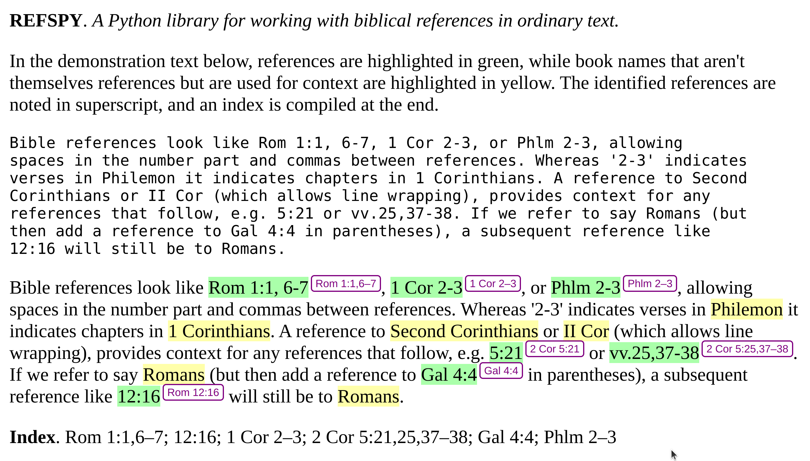

# README 


[](https://www.python.org)
[](https://www.gnu.org/licenses/gpl-3.0)


## Introduction

Refspy is a biblical referencing library in Python. See
[docs/INTERNALS.md](docs/INTERNALS.md) for implementation.

## Demo

See [refspy/docs/](refspy/docs/).



## Features

* Find biblical references in strings, using normal shorthands
* Construct and manipulate verses, ranges, and references
* Format references as names, abbreviated names, and URL parameters
* Store verses as `UNSIGNED INT(12)` for database indexing
* Compare and sort verses, ranges, and references (`<`, `==`, `>=`)
* Test if a range contains, overlaps, or adjoins another range
* Collate references by library and book for iteration
* Sequentially replace matched references in strings, e.g. with HTML links
* In English, we follow SBL conventions, including matching 'First Corinthians'
  for '1 Corinthians'.


## Installation

```
pip install refspy
```


## The Reference Manager


Initialising `refspy` with corpus and language names will return a reference
manager. This provides a single convenient interface for the whole library. 

```
from refspy.helper import refspy

__ = refspy()

__ = refspy('protestant', 'en_US')  # <-- default
__ = refspy('catholic', 'en_US')
__ = refspy('orthodox', 'en_US')
```

The file `refspy/corpus.py` shows valid corpus names, and `refspy/language.py`
contains valid language names.
```
from refspy.language.en import ENGLISH
from refspy.libraries.en_US import NT, OT, OT_Apoc
from refspy.libraries.es_ES import NT as NT_es
from refspy.manager import Manager 

M1 = Manager(libraries=[OT, NT], ENGLISH)            # Protestant Canon in English
M2 = Manager(libraries=[OT, OT_Apoc, NT], ENGLISH)   # Catholic Canon in English
M3 = Manager(libraries=[NT_es], SPANISH)             # New Testament in Spanish
```

The `en_US` libraries conform to the SBL Style Guide for book names and
abbreviations. Other libraries can be defined in the libraries directory.


### Creating references 

Shortcut functions can create simple references using any book name,
abbreviation, code, or alias in the libraries list. Firstly, we can create
references from strings:

```
___.r('Rom 2:3-4,7')
```

A reference contains a list of ranges (see below). It can sort and combine
these to keep the references as compact as possible. We can use the `__.name`
and `__.abbrev` functions to get back string references again:

TODO: Combinations

```
ref = __.r('Rom 2:6,9,1,2')
assert __.name(ref) == 'Romans 2:1-2,6,9'

ref = __.r('Rom 2:6,9,1,2', sort=False, combine=False)
assert __.abbrev(ref) == 'Rom 2:6,9,1,2'
```

We can construct references more programmatically with `__.bcv()`:

```
___.bcv('rom')                # Rom (whole book)  
___.bcv('rom', 2)             # Rom 2 (whole chapter)
___.bcv('rom', 2, 2)          # Rom 2:2
___.bcv('rom', 2, 2, 3)       # Rom 2:2-3 (optional end verse)
```

Or `__.bcr()` to specify book, chapter and verse ranges:

```
___.bcr('rom', 2, [(2, 3), 7])    # Rom 2:2-3,7 (from range) 
```


### Comparing references

A reference can be a set of any verses and verse ranges spread across multiple
libraries. Comparing references A and B means checking that all ranges in A are
less than all ranges in B. For large or complex references this is not
intuitive and not recommended. Comparing simple references is reasonable,
however, as it just involves comparing simple ranges: 

```
rom_2 = __.r('Rom 2')
rom_4 = __.r('Rom 4')
rom_4a = __.bc('rom', 4)

rom_2 < rom_4    # True
rom_2 >= rom_4   # False
rom_4 == rom_4a  # True
```

Because references can be compared with `<`, they can also be sorted, or used
in `min()` and `max()`. 

```
sorted([rom_4, rom_2]) == [rom_2, rom_4]  # True
min([rom_4, rom_2]) == rom_2
```

### Contains, Overlaps, Adjoins

We will commonly want to know if one reference `contains()`, or `overlaps()`
another. The `adjoins()` function allows adjacent references to be combined by the
`__.simplify() ` function, but note it is limited by not knowing the lengths of
chapters.

```
gen1 = __.r('Gen 1') 
gen2 = __.r('Gen 2') 
gen1_23_23 = __.r('Gen 1:22-23') 
gen1_24_28 = __.r('Gen 1:24-28')
  
gen = __.b('Gen')
ex = __.b('Ex')

gen1.contains(gen1_22_23)       # True
gen1_22_23.overlaps(gen1)       # True
gen1_22_23.adjoins(gen1_24_28)  # True
gen1.adjoins(gen2)              # True
gen1.overlaps(gen2)             # False
gen.adjoins(ex)                 # True
gen.overlaps(ex)                # False
```


### Manipulating references

References can be turned into their first book object, a list of books, or a
reference to just their book or chapter ranges.

```
ref1 = __.ref('Rom 2:3-4,7')

__.book(ref1).name      # Romans
__.book(ref1).abbrev    # Rom
__.book(ref1).code      # rom

ref2 = __.ref('Rom 2, Php 4')

", ".join(__.book().name for _ in __.books(ref2, unique=True, sorted=True))  
  
^ Romans, Philippians

__.name(__.book_reference(ref1))       # Romans
__.name(__.chapter_reference(ref1))    # Romans 2
```


### Formatting references

```
ref = ___.r('Rom 2:3-4, 7')

__.name(ref)           # 'Romans 2:3-4,7'
__.abbrev(ref)         # 'Rom 2:3-4,7'
__.code(ref)           # 'rom+2.3-4,7'
__.numbers(ref)        # '2:3-4,7'
```


### Navigating references

```
assert next_chapter(rom_2) == rom_3
assert prev_chapter(rom_2) == rom_1
assert prev_chapter(rom_1) == acts_28
```


### Matching references in text

Here's how we might find references in text and print HTML links for them:

```
url = 'https://www.biblegateway.com/passage/'

text = "Rom 1; 1 Cor 8:3,4; Rev 22:3-4"
   
strs, refs = __.find_references(text)
for s, ref in zip(strs, refs):
   print f"{s} -> {url}{?search={__.code(ref)}&version=NRSVA"
```

### Creating chapter references

```
from refspy.libraries.en_US import NT

nt_chapter_refs_ = [  
  __.bcv(book.name, ch)   
  for ch in range(1, book.chapters)   
  for book in NT.books  
] 
```

### Replacing references in text

To produce the demo image above, we use the `sequential_replace` function from `refspy/utils`:

```
from refspy.utils import sequential_replace

matches = __.find_references(text, include_books=True)
strs, tags = [], []
for match_str, ref in matches:
    strs.append(match_str)
    if is_book_reference(ref):
        tags.append(f'<span class="yellow">{match_str}</span>')
    else:
        tags.append(
            f'<span class="green">{match_str}</span><sup>{__.abbrev(ref)}</sup>'
        )
html = sequential_replace(text, strs, tags)}
```

### Collating and Indexing

References lists can be created for text using __.find_references(), and
grouped into libraries and books using __.collate(). 

To produce the index for the demo image above, we used:

```
index = []
for library, book_collation in __.collate(
    sorted([ref for _, ref in matches if not is_book_reference(ref)])
):
    for book, reference_list in book_collation:
        new_reference = __.merge(reference_list)
        index.append(__.abbrev(new_reference))

html_list = "; ".join(index)
```
